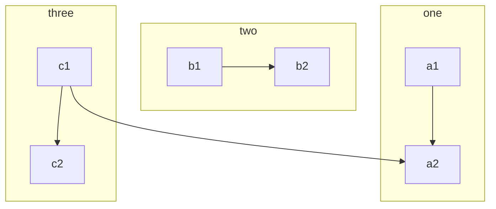
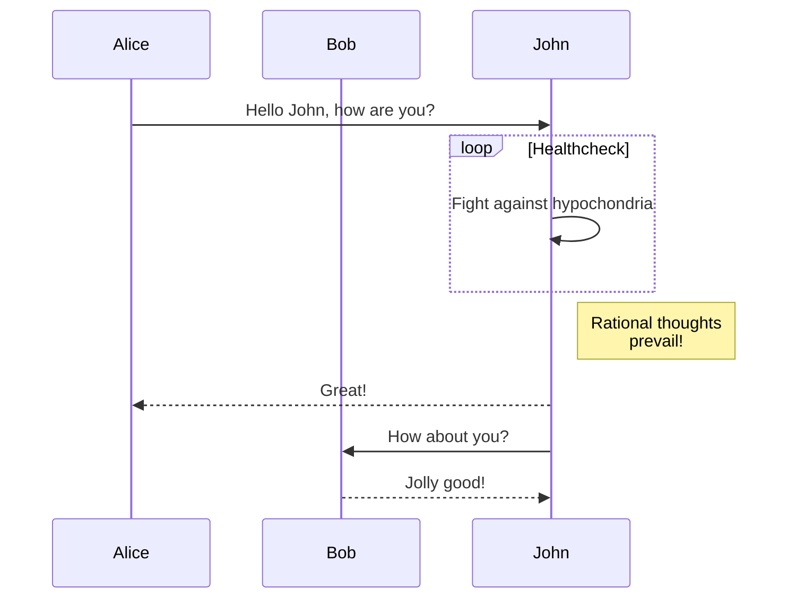
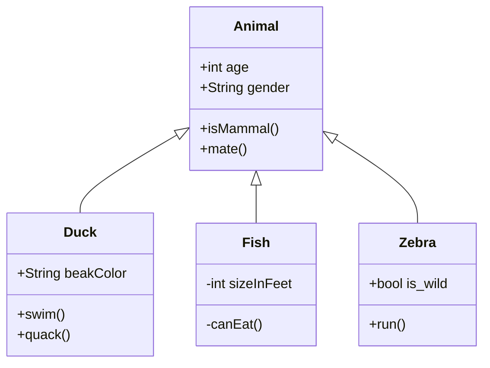
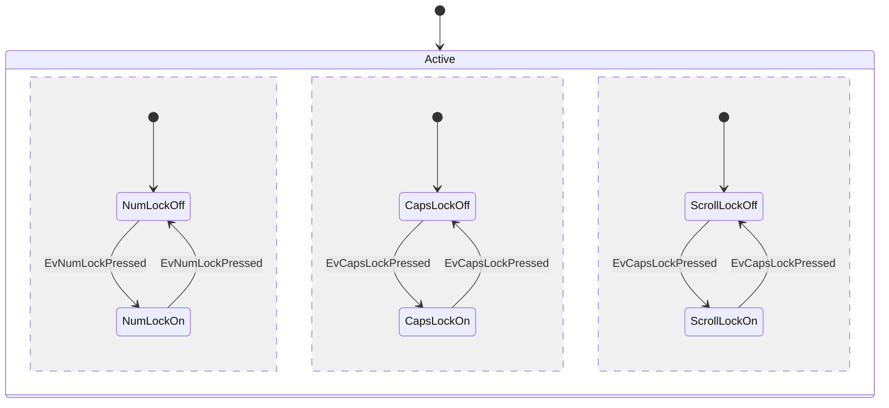
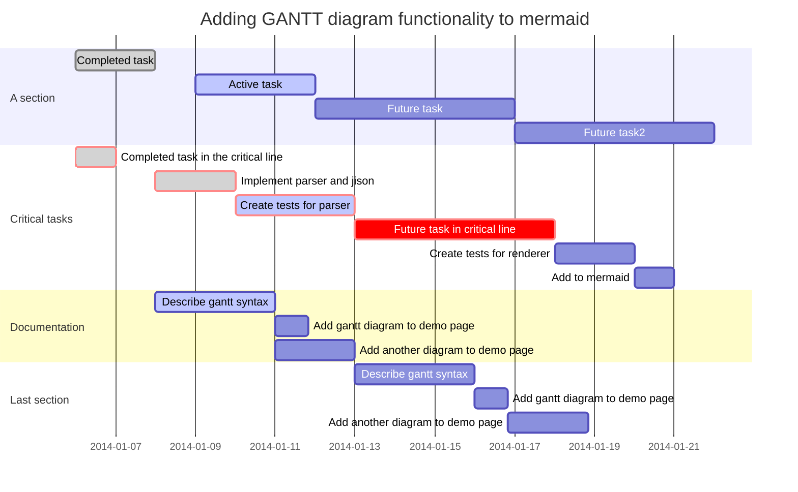
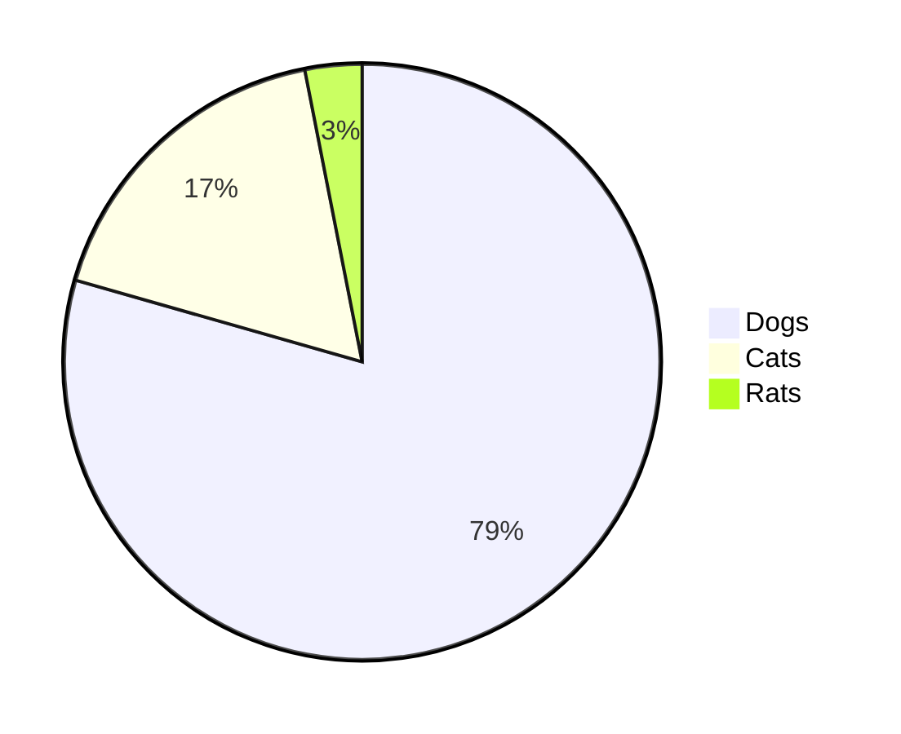

架构图

用代码画!

<!-- more --> 

#  flowchart

```mermaid
graph TD;
    A-->B;
    A-->C;
    B-->D;
    C-->D;
```

```mermaid
graph TB
    c1-->a2
    subgraph one
    a1-->a2
    end
    subgraph two
    b1-->b2
    end
    subgraph three
    c1-->c2
    end
```
# Sequence diagrams

```mermaid
sequenceDiagram
    participant Alice
    participant Bob
    Alice->>John: Hello John, how are you?
    loop Healthcheck
        John->>John: Fight against hypochondria
    end
    Note right of John: Rational thoughts <br/>prevail!
    John-->>Alice: Great!
    John->>Bob: How about you?
    Bob-->>John: Jolly good!
```
# Class diagrams

```mermaid
classDiagram
     Animal <|-- Duck
     Animal <|-- Fish
     Animal <|-- Zebra
     Animal : +int age
     Animal : +String gender
     Animal: +isMammal()
     Animal: +mate()
     class Duck{
         +String beakColor
         +swim()
         +quack()
     }
     class Fish{
         -int sizeInFeet
         -canEat()
     }
     class Zebra{
         +bool is_wild
         +run()
     }	 
```
# State diagrams

```mermaid
stateDiagram
       [*] --> Active

       state Active {
           [*] --> NumLockOff
           NumLockOff --> NumLockOn : EvNumLockPressed
           NumLockOn --> NumLockOff : EvNumLockPressed
           --
           [*] --> CapsLockOff
           CapsLockOff --> CapsLockOn : EvCapsLockPressed
           CapsLockOn --> CapsLockOff : EvCapsLockPressed
           --
           [*] --> ScrollLockOff
           ScrollLockOff --> ScrollLockOn : EvCapsLockPressed
           ScrollLockOn --> ScrollLockOff : EvCapsLockPressed
       }
```
# Gantt diagrams

```mermaid
gantt
       dateFormat  YYYY-MM-DD
       title Adding GANTT diagram functionality to mermaid

       section A section
       Completed task            :done,    des1, 2014-01-06,2014-01-08
       Active task               :active,  des2, 2014-01-09, 3d
       Future task               :         des3, after des2, 5d
       Future task2              :         des4, after des3, 5d

       section Critical tasks
       Completed task in the critical line :crit, done, 2014-01-06,24h
       Implement parser and jison          :crit, done, after des1, 2d
       Create tests for parser             :crit, active, 3d
       Future task in critical line        :crit, 5d
       Create tests for renderer           :2d
       Add to mermaid                      :1d

       section Documentation
       Describe gantt syntax               :active, a1, after des1, 3d
       Add gantt diagram to demo page      :after a1  , 20h
       Add another diagram to demo page    :doc1, after a1  , 48h

       section Last section
       Describe gantt syntax               :after doc1, 3d
       Add gantt diagram to demo page      :20h
       Add another diagram to demo page    :48h
```
# Pie chart diagrams

```mermaid
pie
    "Dogs" : 386
    "Cats" : 85
    "Rats" : 15
```